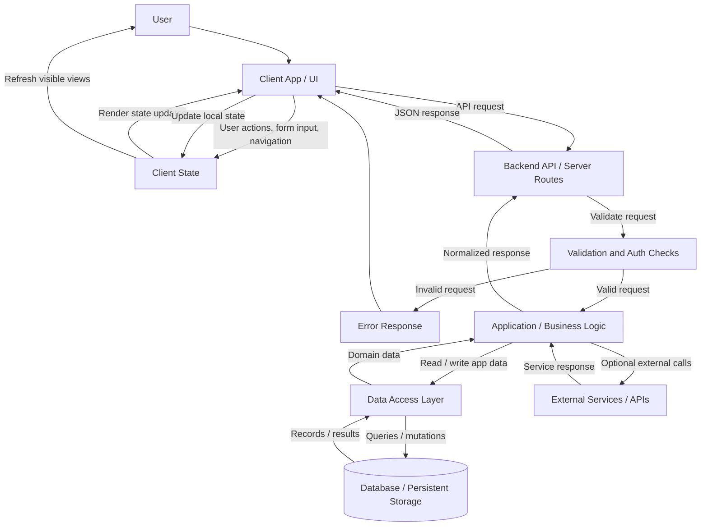
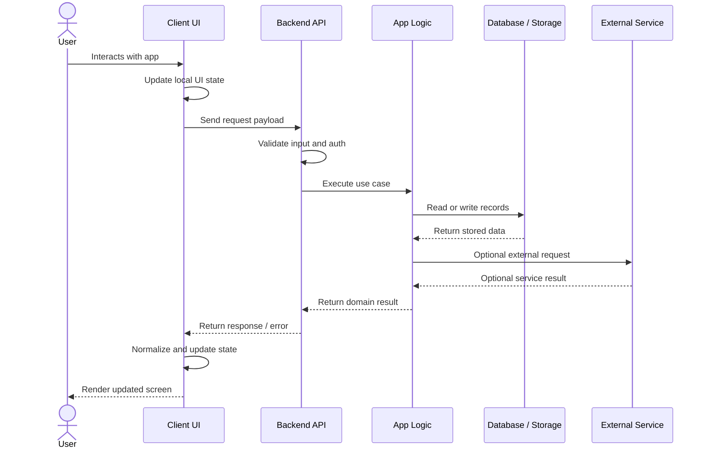
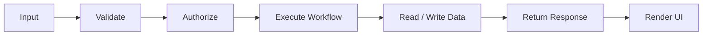
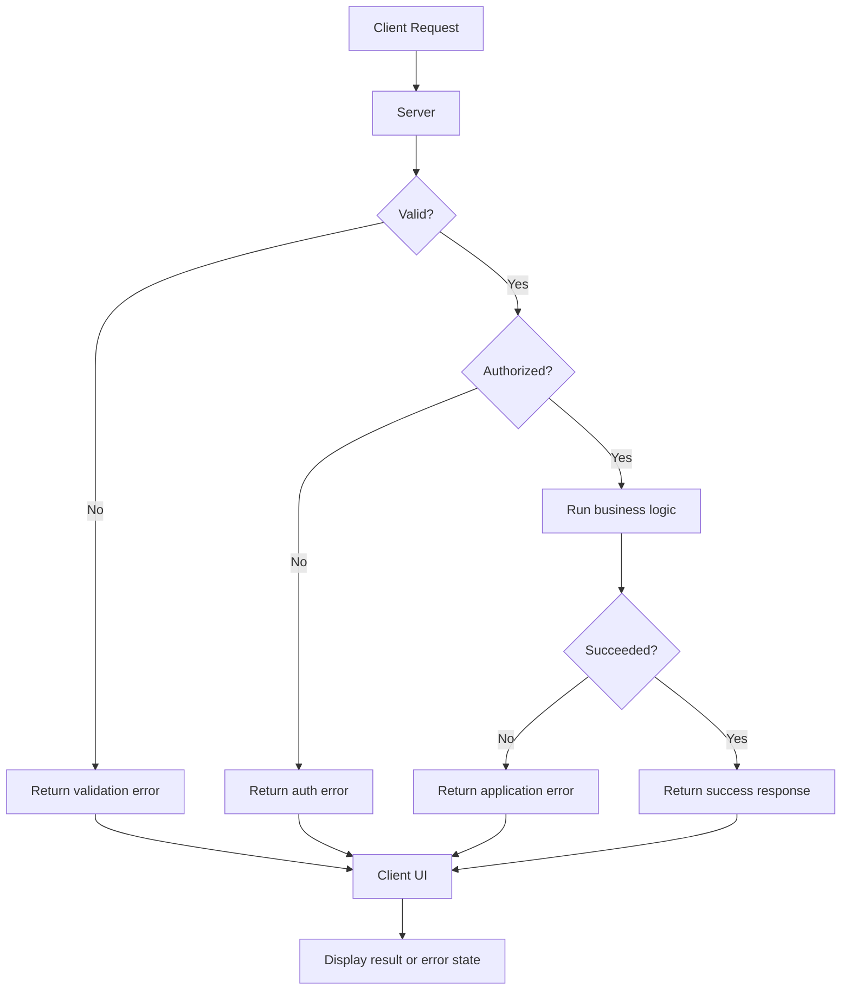

# Technical Approach Flow

This document describes the high-level app flow, the major runtime components, and how data moves through the system.

## App Flowchart

## How The App Works

1. The user interacts with the client interface.
2. The UI stores immediate interaction state locally, such as form values, loading states, selected views, and temporary errors.
3. When the user performs an action that needs server-side data, the client sends a request to the backend API or server route.
4. The server validates the request, checks authentication or authorization where needed, and rejects invalid requests early.
5. Valid requests are passed into the application logic layer.
6. The application logic reads from or writes to persistent storage through the data access layer.
7. If a workflow depends on an external service, the backend calls that service and folds the result into the app response.
8. The backend returns a normalized response to the client.
9. The client updates local state and re-renders the relevant UI.

## Data Movement

## Main Responsibilities

| Layer | Responsibility |
| --- | --- |
| User Interface | Presents screens, captures user input, displays loading, success, and error states. |
| Client State | Holds temporary UI state and server response data needed for rendering. |
| Backend API | Receives client requests, validates inputs, handles auth checks, and returns structured responses. |
| Application Logic | Owns the core workflow decisions and coordinates storage or service calls. |
| Data Access Layer | Encapsulates database queries and persistence operations. |
| Database / Storage | Stores durable application data. |
| External Services | Provides third-party capabilities such as AI, payments, messaging, search, or integrations when used. |

## Request Lifecycle

## Error Handling Flow

## Notes For Contributors

- Keep validation close to the API boundary so bad input does not enter the core workflow.
- Keep persistent data access behind a small data layer so storage changes do not leak across the app.
- Keep UI state separate from durable server data where possible.
- Return predictable response shapes from backend routes so the client can handle loading, success, and error states consistently.
- Add new external integrations behind the backend layer instead of calling them directly from the client unless there is a clear reason to expose that interaction.
