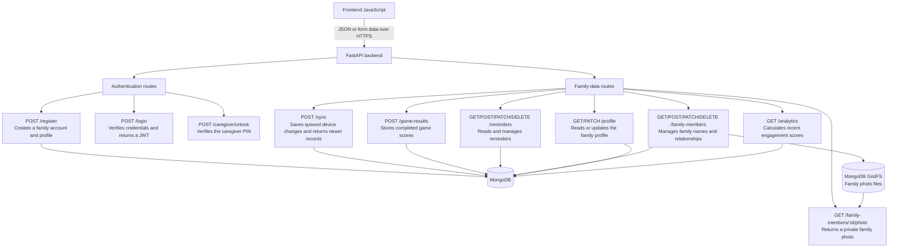

# SmritiAI

SmritiAI is a vanilla JavaScript, offline-first PWA for gentle cognitive engagement and family-supported routines. It includes six playable activities, reminders, family-photo recognition, multilingual UI, a rule-based companion, caregiver analytics, and PDF reporting. It is an assistive engagement tool, not a diagnostic or emergency-response service.

## Data flow

The frontend sends authenticated requests to FastAPI. The API scopes each request to its family account, then stores structured records in MongoDB; uploaded family photos are resized, converted to WebP, and stored in MongoDB GridFS.

## Local development

1. Run `npm install`.
2. Run `npm run dev` for the PWA.
3. Copy `backend/.env.example` to `backend/.env` and provide a MongoDB connection plus secure JWT secret.
4. Install `backend/requirements.txt`, then run `uvicorn main:app --reload` from `backend/`.

The guided demo is local-only and uses fictional data. Its caregiver PIN is `2468`.

## Production

`npm run build` creates the static `dist/` directory. Set `frontend/config.js` to the public HTTPS API URL before building. `render.yaml` describes the FastAPI deployment; set `MONGODB_URI` and `ALLOWED_ORIGINS` in the service environment.
